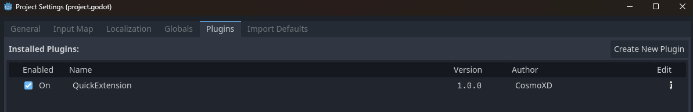
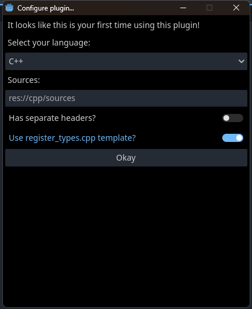
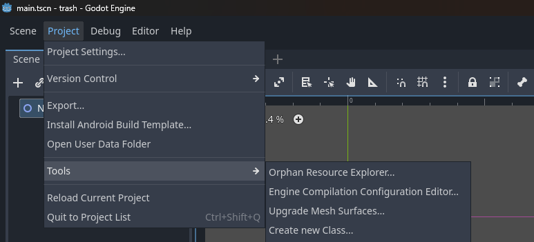

# QuickExtension
Make games (GDExtensions) faster than before when using GDExtension (C++ supported only for now).

When I was making the third prototype of my game ShapeWorld: FightLand I did it in Godot 4 using C++ since I like the performance and also, the C++ syntax is nice but after working some time in the project, using C++ as the main programming language became annoying because every time I wanted to create a new class / node, I had to create the files manually and rewrite the same code again and also had to create the source file, the header and then add the new files to the build (I was using CMake) so after a month of working in the game I stopped working on it due to this annoying issue (and other problems I found in the engine back then), because of this I made this simple extension, this extension allows you to create classes / nodes in a easy way.

# Set up
First, you need to download this extension, to do this, you can download it by [cloning this repository](https://github.com/ElCosmoXD/QuickExtension/archive/refs/heads/main.zip) using the `Code->Download` ZIP button or you can download it from the [Releases page](https://github.com/ElCosmoXD/QuickExtension/releases).

Once you have the `addons/QuickExtension` folder, you have to go to the Godot Editor and go to the `Project/Project Settings...` tab, then go to `Plugins` and enable the extension.

Now, a popup window will appear to configure the plugin, it is important to **not close the window**, if you close the window, reload the project.

After setting up the plugin, go to `Project/Tools/Create New Class...` and create your class / node by filling the fields in the window.

With everything done, you can now see that in your specified header/source folders are now the new files with the initial code for a class.

# Customization
The files that this plugin generates are very easy to customize, the templates that this plugin uses are located in `addons/QuickExtension/Templates`.

### Custom source / header files
To customize the generated source and header files, go to the Templates folder and customize the `Class-Template.cpp.txt` and `Class-Template.h.txt` files. **Do not remove the text in uppercase** since that text is used to replace the class names. Also, do not delete the `#include <godot_cpp/classes/template_replace_base_class_header.h>` include.

### Custom types register
To customize the generated `register_types.cpp`, you can go to the Templates folder and modify it as you like but **don't delete or move the `/* REPLACE THIS WITH THE USER CLASSES */` line to another function outside `initialize_gdextension_types`** since that line is replaced with the classes you have registered in the plugin.

# Roadmap
This extension is in a pretty early state and there are many things to improve, with that said, every PR with new features or fixes are always welcome.

Things missing / TODO:

- [ ] Support for other languages (Rust, Go, C, etc)
- [ ] Build project from editor
- [ ] Add generated files to CMake (or other build system)
- [ ] Support for generating files using CamelCase names

# Credits

[godot-cpp](https://github.com/godotengine/godot-cpp): The project used the examples from the `test` folder to create the templates.
