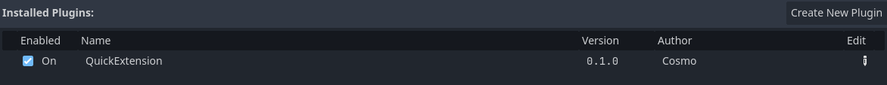
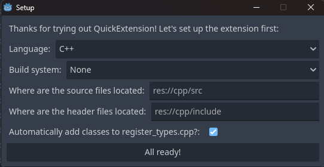
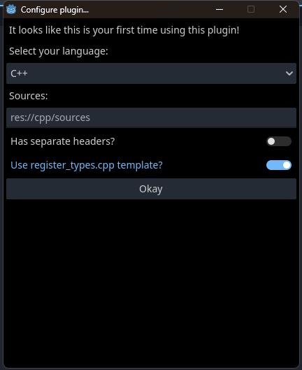
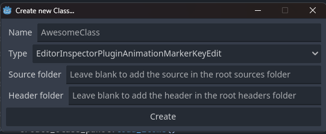

# QuickExtension
A tool for developing games easier using GDExtension.

When I was making the third prototype of my game ShapeWorld: FightLand I did it in Godot 4 using C++ because I liked the performance gain and also, the C++ syntax was nice but after some time working in the project, using C++ as the main programming language became annoying because every time I wanted to create a new class, I had to create the files manually and rewrite the same code again and again, also I had to add the new files to the build system (I was using CMake) so after a month of working in the game I stopped working on it due to many annoying issues I was facing with the engine back then (and of course, the annoying workflow was a reason), because of this, I made this extension, this extension allows you to create classes easier and faster so you can make your workflow a little bit better.

# Set up
First, you need to download this extension, to do this, you can download it by [cloning this repository](https://github.com/ElCosmoXD/QuickExtension/archive/refs/heads/main.zip) using the `Code->Download ZIP` button or you can download it from the [Releases page](https://github.com/ElCosmoXD/QuickExtension/releases).

Once you have the `addons/quick_extension` folder, you have to open your project in the Godot Editor, then go to `Project/Project Settings...` and open the `Plugins` tab and finally, enable the extension.

Now, a popup window will appear to configure the plugin, it is important **not to close the window**, if you close the window, reload the project.

After setting up the plugin, go to `Project/Tools/Create New Class...`

Now you can create your new class by filling the fields in a popup that will appear.

**Note:** The fields may vary depending on the selected language for the extension

With everything done, you can now see that in your header/source folders are now the new files with the initial code for a basic class.

# Roadmap
This extension is in a pretty early state and there are many things to improve, with that said, every PR with new features or fixes are always welcome.

Things missing / TODO:

- [ ] Support for other languages (Rust, Go, C, etc)
- [ ] Build project from editor
- [ ] Add generated files to CMake (or other build system)

# Customization
The files that this plugin generates are very easy to customize, the templates that this plugin uses are located in `addons/quick_extension/templates`.

### Custom source / header files
To customize the generated source and header files, go to the templates folder and customize the `Class-Template.cpp.txt` and `Class-Template.h.txt` files as you like. **Do not remove the text in uppercase or commentaries!** since that text is used to replace the class names or other generated content. Also, do not delete the `#include <godot_cpp/classes/template_replace_base_class_header.h>` include.

### Custom types register
To customize the generated `register_types.cpp`, you can go to the templates folder and modify it as you like but **don't delete or move the `/* REPLACE THIS WITH THE USER CLASSES */` line to another function outside `initialize_gdextension_types`** since that line is replaced with the classes you have registered with the plugin.

# Credits

[godot-cpp](https://github.com/godotengine/godot-cpp): The project used the examples from the `test` folder to create the templates.
